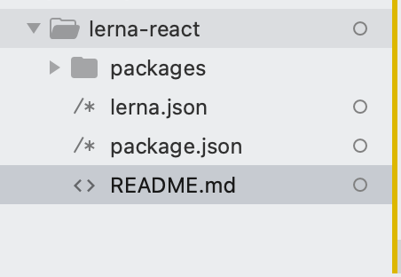
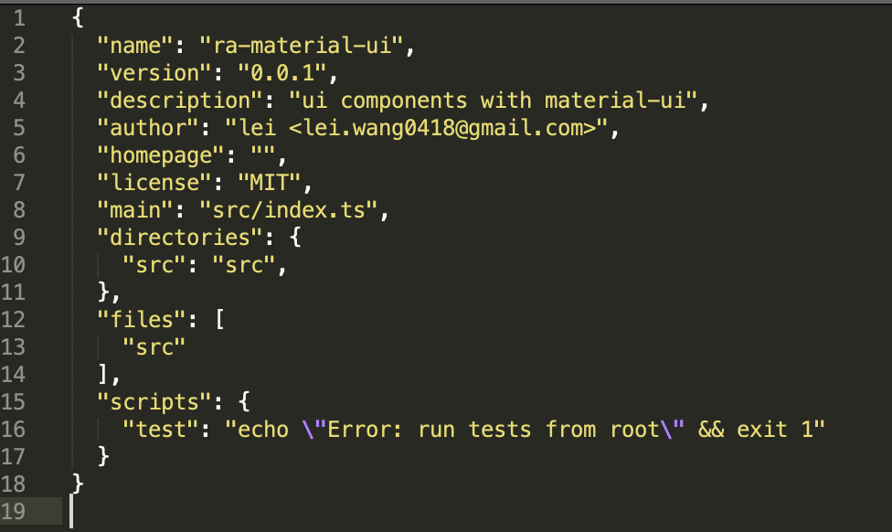
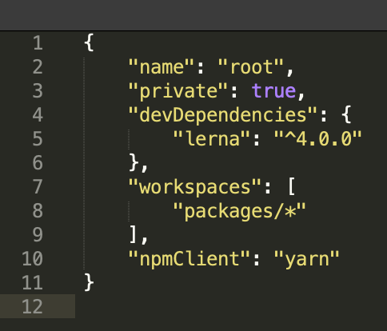
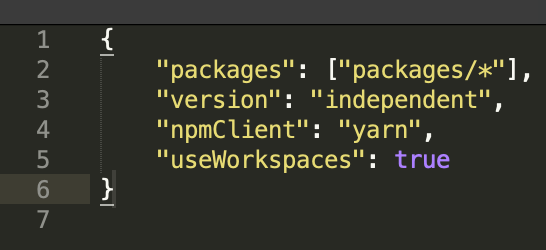

## `lerna` + `storybook` + `craco` + `typescript`

## 安装 lerna

```sh
yarn global add lerna
```

## 创建根目录

```sh
mkdir lerna-react
cd lerna-react

lerna init --independent
#or(使用统一版本)
lerna init
```

## 项目结构



## 创建一个公共组件库

```sh
lerna create ra-material-ui
```
## 配置`tsconfig.json`
```json
{
    "compilerOptions": {
        "rootDir": "src",
        "outDir": "build",
        "target": "es5",
        "lib": ["dom", "dom.iterable", "esnext"],
        "allowJs": true,
        "skipLibCheck": true,
        "esModuleInterop": true,
        "allowSyntheticDefaultImports": true,
        "strict": true,
        "forceConsistentCasingInFileNames": true,
        "noFallthroughCasesInSwitch": true,
        "module": "esnext",
        "moduleResolution": "node",
        "resolveJsonModule": true,
        "isolatedModules": true,
        "noEmit": true,
        "jsx": "react-jsx"
    },
    "include": ["src/**/*"],
    "exclude": ["node_modules", "build"]
}
```
## ra-material-ui/package.json 完整内容如下所示
[]

## 安装 `storybook` `react` `react-dom` `babel` `@babel/core`
```sh
lerna add @storybook/react packages/ra-material-ui
lerna add @storybook/preset-create-react-app packages/ra-material-ui -D

lerna add @types/node packages/ra-material-ui
lerna add @types/react packages/ra-material-ui

lerna add react packages/ra-material-ui
lerna add react-dom packages/ra-material-ui
lerna add @types/react-dom packages/ra-material-ui
lerna add @testing-library/react packages/ra-material-ui
lerna add @testing-library/user-event packages/ra-material-ui
lerna add @types/jest packages/ra-material-ui
lerna add @testing-library/jest-dom packages/ra-material-ui
lerna add typescript packages/ra-material-ui

lerna add @material-ui/core packages/ra-material-ui
```

## 配置启动项
```sh
"scripts": {
    "start": "start-storybook -p 9009"
    ...
  },
```
## 配置storybook
在ra-material-ui根目录建`.storybook/main.js`文件,内容如下:
```js
module.exports = {
    stories: ['../src/**/*.stories.@(ts|tsx)'],
    addons: ['@storybook/preset-create-react-app'],
    typescript: {
        check: false,
        checkOptions: {},
        reactDocgen: 'react-docgen-typescript',
        reactDocgenTypescriptOptions: {
            shouldExtractLiteralValuesFromEnum: true,
            propFilter: (prop) => (prop.parent ? !/node_modules/.test(prop.parent.fileName) : true)
        }
    }
};
```

## 启动(能启动,但无任何内容)
```sh
cd packages/ra-material-ui
yarn start
```

## 创建一个组件
在`src/components/layout/index.tsx`中添加如下内容:
```tsx
import React from "react";
import MatButton from "@material-ui/core/Button";

const Button = () => 
   <MatButton>
         button
   </MatButton>;

export default Button;
```

配置 babel build
* 安装
```sh
lerna add @babel/core packages/ra-material-ui -D
lerna add @babel/cli packages/ra-material-ui -D
lerna add @babel/preset-env packages/ra-material-ui -D
lerna add @babel/preset-react packages/ra-material-ui -D
lerna add @babel/preset-typescript packages/ra-material-ui -D
```

* `ra-material-ui`目录创建`.babelrc`内容如下:
```json
{
   "presets": ["@babel/preset-typescript", "@babel/preset-env", "@babel/preset-react"]
}
```

* `ra-material-ui`目录创建`tsconfig.json` 增加内容如下:
```json
{
    ...
    "compilerOptions": {
        ...
        // Target latest version of ECMAScript.
        "target": "esnext",
        // Search under node_modules for non-relative imports.
        "moduleResolution": "node",
        // Process & infer types from .js files.
        "allowJs": true,
        // Don't emit; allow Babel to transform files.
        "noEmit": true,
        // Enable strictest settings like strictNullChecks & noImplicitAny.
        "strict": true,
        // Import non-ES modules as default imports.
        "esModuleInterop": true,
        "jsx": "react-jsx"
        ...
    }
    ...
}
```

## 配置build

```sh
  "scripts": {
    ...
    "watch": "babel --watch src ---out-dir build --extensions .ts,.tsx",
    "build": "babel src --out-dir build --extensions .ts,.tsx"
    ...
  }
```

## 启动(ra-material-ui目录下运行)
```sh
yarn start
```

========================================================
## 支持任意位置启动 story
配置支持 yarn workspace  

* 配置 lerna-react/package.json  

* 配置 lerna-react/lerna.json  



* lerna-react根目录下package.json添加命令
```json
    "scripts": {
        "story": "yarn lerna run story --stream"
    }
```
==========================================================

## 使用CRA创建typesctip react项目
```sh
cd packages/
yarn create react-app admin --template typescript
```

## admin中引入公共组件包
```sh
lerna --scope admin add ra-material-ui
```

## 更新`admin/src/App.tsx`
```
import React from 'react';
import { Button } from 'ra-material-ui';

function App() {
  return <div className="App">
    <Button>ra-material-ui button component</Button>
  </div>;
}

export default App;

```
会发现出错，原因是react-dom 只在当前`src` `node_modules`下查询引用，而非其它子项目，基于这种问题，有很多处理方法,如复制代码，eject以后重定义src路径，通过查询重定义路径等。
* craco
* react-app-rewired
* cra-overrides, etc
* eject

## 使用`craco`支持src可配置
```sh
lerna add @craco/craco packages/admin
lerna add craco-babel-loader packages/admin
```
## react子项目根目录添加admin/craco.config.js配置
```js
const path = require('path');
const cracoBabelLoader = require('craco-babel-loader')
const resolvePackage = relativePath => path.resolve(__dirname,relativePath);

module.exports = {
    plugins:[{
      plugin:cracoBabelLoader,
      options:{
         includes:[resolvePackage('../ra-material-ui')],
         excludes:[/node_modules/]
      }
   }]
};

```

## 修改pacekage.json使用`craco`命令，替换`react-scripts`
```json
  "scripts": {
    - "start": "react-scripts start",
    + "start-admin": "craco start",
    - "build": "react-scripts build",
    + "build": "craco build",
    - "test": "react-scripts test",
    + "test": "craco test",
  },
```

## 支持任意位置启动 admin
* 修改`lerna-react/package.json`文件
```json
    "scripts": {
        ...
        + "admin": "yarn lerna run start-admin --stream"
        ...
    }
```
